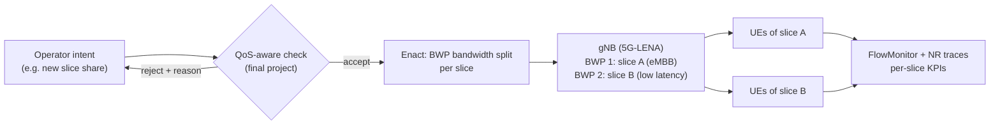

# A1: Background Study Notes

**Course:** Multimedia Wireless Networks (ET5907701), Fall 2026 · **Student:** Petrajoy Davidson (M11502803) · **Path:** Advanced · **Due:** Week 4, 2026/09/29, 08:00 · **Presentation:** 5 minutes

## Table of Contents

1. [Five-Minute Presentation](#1-five-minute-presentation)
2. [How to Read a Paper](#2-how-to-read-a-paper)
3. [Project Proposal](#3-project-proposal)
   - [3.1 Path and Topic](#31-path-and-topic)
   - [3.2 Problem](#32-problem)
   - [3.3 Research Question and Hypothesis](#33-research-question-and-hypothesis)
   - [3.4 System Model](#34-system-model)
   - [3.5 Planned Scenarios](#35-planned-scenarios)
   - [3.6 KPIs to Measure](#36-kpis-to-measure)
   - [3.7 Simulation Settings (Initial)](#37-simulation-settings-initial)
   - [3.8 Plan Across the Assignments](#38-plan-across-the-assignments)
   - [3.9 Risks and Open Questions](#39-risks-and-open-questions)
4. [References](#4-references)

## 1. Five-Minute Presentation

Five minutes is about 600 to 700 spoken words. There is room for one message, not a full paper.

**Rules I will follow**

| Rule | In practice |
| --- | --- |
| One message | Write the take-away in one sentence before making any slide |
| Few slides | About 4 to 5 slides; the lab guideline is roughly 0.8 slides per minute of talk |
| Time budget | Plan every slide in seconds and rehearse against a timer |
| Problem first | Open with the problem the audience should care about, not with an outline slide |
| Figures over text | One figure or table per slide; no paragraphs |
| End with the ask | Close by repeating the message and what comes next |
| Rehearse | Record with PowerPoint Speaker Coach, fix pace and filler words, record again |

**My A1 slide plan (5 minutes)**

| # | Slide | Time |
| --- | --- | --- |
| 1 | The problem: one wrong slice intent can break another slice's QoS | 0:45 |
| 2 | Why it matters: intents are enacted automatically, and today's feasibility check only asks "does it fit in capacity?" | 0:45 |
| 3 | Proposal: measure the QoS damage in ns-3 and test a QoS-aware check before enactment | 1:15 |
| 4 | What I will measure: the KPI table | 1:15 |
| 5 | Plan to the final project and the one-line take-away | 1:00 |

## 2. How to Read a Paper

Summary of S. Keshav, "How to Read a Paper" [1]. The idea: read a paper in up to **three passes**, each with a clear goal, instead of reading once from start to end.

| Pass | Time | What to do | Result |
| --- | --- | --- | --- |
| 1. Bird's-eye view | 5 to 10 min | Read title, abstract, introduction; read only section headings; read conclusions; glance at references | Answer the **five Cs**, decide whether to read further |
| 2. Content | Up to 1 hour | Read carefully but skip proofs; study figures and graphs (axes labeled? error bars?); note key points; mark unread references | Summarize the main idea and its evidence to someone else |
| 3. Depth | 4 to 5 hours for a beginner, about 1 hour when experienced | Virtually re-implement the paper under the same assumptions; challenge every assumption; note ideas for future work | Rebuild the paper's structure from memory, name its strengths, weaknesses, and hidden assumptions |

**The five Cs (end of pass 1)**

1. **Category:** what type of paper is it (measurement, analysis of an existing system, prototype)?
2. **Context:** which papers and theories does it build on?
3. **Correctness:** do the assumptions look valid?
4. **Contributions:** what are the main contributions?
5. **Clarity:** is it well written?

**Literature survey with the three passes:** find 3 to 5 recent papers with good keywords, do one pass each, and read their related work sections (look for a survey). Then find shared citations and repeated authors: those are the key papers and researchers, and their venues are the top conferences. Scan recent proceedings of those venues, and make two passes over the collected papers.

**How I will use it in this course**

| Assignment | Pass needed |
| --- | --- |
| A3 literature review: choose papers | Pass 1 on 10 or more candidates, keep 1 to 3 |
| A3: problem, system model, metrics, ns-3 settings | Pass 2, with notes on each figure's axes and parameters |
| A4 baseline reproduction | Pass 3: re-implementing the chosen result in ns-3 is exactly the "virtual re-implementation" |

## 3. Project Proposal

> [!NOTE]
> First draft, to be revised in A3 after the literature review.

### 3.1 Path and Topic

**Path:** Advanced (bring your own topic), connected to my thesis on validating intents before enactment in O-RAN intent-based management.

**Working title:** QoS impact of slice-reallocation intents in 5G NR, and a QoS-aware check before enactment.

**Simulator:** ns-3 with the 5G-LENA NR module [2], which supports multiple bandwidth parts (BWPs) and maps traffic types to them. Each BWP will represent one network slice.

### 3.2 Problem

In intent-based network management, an operator states a goal in natural language (for example, "guarantee this throughput for slice 1") and the system translates it into configuration automatically. For network slicing, the result is a change in how the cell's radio resources (PRBs) are shared between slices.

Slices share one resource pool. An intent that gives one slice too much, whether by mistake, by a faulty translation, or because it was tampered with, takes resources away from the other slices. A typical feasibility check only asks whether the request fits within the cell's capacity, so an over-allocation that still fits is accepted, and the other slices' QoS silently drops below their targets.

**Why it matters:** the change is enacted with no human in the loop, and low-latency services are the first to fail.
**Why it is hard:** the damage depends on channel quality, load, and the traffic mix of every slice, so it cannot be read from the request alone.

### 3.3 Research Question and Hypothesis

**Questions**

1. How much do the QoS KPIs of a "victim" slice degrade as a slice-reallocation intent gives more of the band to an "aggressor" slice?
2. Can a QoS-aware check, which predicts the victim slice's KPIs before an intent is enacted, reject harmful intents while accepting safe ones?

**Hypotheses**

1. The victim slice's delay grows sharply and its SLA fails well before the aggressor slice's share reaches the capacity limit, so a capacity-only check accepts intents that violate SLAs.
2. A predictor trained on simulated runs can flag those intents with a high detection rate and a low false rejection rate.

### 3.4 System Model

| Element | Description |
| --- | --- |
| Environment | One gNB, UEs in a grid (as in the 5G-LENA `cttc-nr-demo` example [2]), downlink traffic |
| Slices | Slice A: eMBB video-like traffic (aggressor). Slice B: low-latency traffic (victim) |
| Inputs (per run) | Intent = bandwidth share of each slice; number of UEs per slice; offered load per slice; channel condition (UE distance) |
| Outputs | Per-slice throughput, delay, jitter, packet loss, SLA satisfaction; resource share; for the check: accept or reject |
| Baseline behaviour | Enact every intent that fits in capacity (no QoS check) |
| Modification (final project) | Predict the victim slice's KPIs before enactment and reject intents predicted to violate its SLA |

### 3.5 Planned Scenarios

| ID | Goal | Constants | Variables | Figure (X / Y / expected result) |
| --- | --- | --- | --- | --- |
| S1 | Show the QoS damage of over-allocation (the problem) | 1 gNB, UE layout, traffic per slice | Share of the band given to slice A: 50% to 90% | X: slice A share; Y: slice B 95th-percentile delay and packet loss; expected: sharp rise and SLA failure before 90% |
| S2 | Find where the SLA breaks under load | Share of slice A fixed at a harmful value | Number of UEs in slice B: 2, 5, 10 | X: slice B UEs; Y: SLA satisfaction ratio; expected: satisfaction falls faster with more victim UEs |
| S3 | Evaluate the QoS-aware check (final project) | Scenario set from S1 and S2 | Check: none (capacity only) vs. QoS-aware | X: intent share; Y: slice B SLA satisfaction with and without the check; expected: satisfaction stays high with the check |
| S4 | Measure the price of the check | Same intent set as S3 | Decision threshold | X: false rejection rate; Y: harmful-intent detection rate; expected: an operating point with few false rejections |

### 3.6 KPIs to Measure

**Per-slice QoS KPIs** (from ns-3 FlowMonitor [3], computed per flow and aggregated per slice)

| KPI | Definition | Unit | Source |
| --- | --- | --- | --- |
| Throughput $T$ | $\dfrac{8 \cdot \text{rxBytes}}{t_{\text{lastRx}} - t_{\text{firstRx}}}$ | Mbps | FlowMonitor `rxBytes`, `timeFirstRxPacket`, `timeLastRxPacket` |
| Mean delay $\bar{D}$ | $\dfrac{\text{delaySum}}{\text{rxPackets}}$ | ms | FlowMonitor `delaySum`, `rxPackets` |
| 95th-percentile delay $D_{95}$ | 95th percentile of per-packet delay | ms | FlowMonitor delay histogram |
| Jitter $\bar{J}$ | $\dfrac{\text{jitterSum}}{\text{rxPackets} - 1}$ | ms | FlowMonitor `jitterSum` |
| Packet loss rate $PLR$ | $\dfrac{\text{txPackets} - \text{rxPackets}}{\text{txPackets}}$ | % | FlowMonitor `txPackets`, `rxPackets` |
| SLA satisfaction $S$ | Share of runs (or flows) in which the slice meets all its targets below | % | Computed from the KPIs above |

**SLA targets for the victim slice (initial):** use the 3GPP standardized 5QI characteristics for the traffic type (3GPP TS 23.501, Table 5.7.4-1 [4]), for example the packet delay budget and packet error rate of the low-latency eMBB 5QI. The exact 5QI and values will be confirmed against the specification in A2.

**Resource and system KPIs**

| KPI | Definition | Unit | Source |
| --- | --- | --- | --- |
| Configured resource share | Bandwidth of each slice's BWP divided by total bandwidth | % | Scenario configuration (the intent) |
| Measured resource usage | Resource blocks used by each slice over time | % of RBs | 5G-LENA scheduler/PHY traces (exact trace to confirm in A2) |
| Fairness $F$ | Jain's index over slices' normalized throughput: $\dfrac{(\sum_i x_i)^2}{n \sum_i x_i^2}$, $x_i = T_i / T_i^{\text{target}}$ | 0 to 1 | Computed |

**KPIs of the QoS-aware check (final project)**

| KPI | Definition | Unit |
| --- | --- | --- |
| Detection rate | Harmful intents rejected / all harmful intents | % |
| False rejection rate | Safe intents rejected / all safe intents | % |
| Prediction error | Mean absolute error between predicted and simulated $D_{95}$ (and $T$) of the victim slice | ms (Mbps) |
| Decision time | Wall-clock time the check needs per intent | ms |

An intent is labeled **harmful** if enacting it makes the victim slice miss at least one SLA target in simulation, and **safe** otherwise.

### 3.7 Simulation Settings (Initial)

To be fixed in A2 (first scenario) and A3 (after reading the papers).

| Parameter | Initial choice |
| --- | --- |
| Simulator | ns-3 with 5G-LENA (NR) |
| Topology | 1 gNB; UEs on a grid, as in `cttc-nr-demo` |
| Slices | 2 BWPs: slice A (eMBB traffic), slice B (low-latency traffic) |
| Traffic | Downlink UDP; constant bit rate first, video-like variable rate later |
| Swept parameters | Slice A bandwidth share, UEs per slice, offered load |
| Simulation time | Long enough for stable statistics (to decide in A2 from a warm-up check) |
| Runs | At least 10 independent seeds per point; report mean and 95% confidence interval |

### 3.8 Plan Across the Assignments

| Assignment | Deliverable for this project |
| --- | --- |
| A2 (10/20) | ns-3 + 5G-LENA installed; two BWPs (two slices) running; per-slice throughput, delay, and loss printed from FlowMonitor |
| A3 (11/17) | 1 to 3 IEEE papers on RAN slicing QoS in 5G NR simulation; system model and ns-3 settings from each; revised proposal |
| A4 (12/1) | One figure reproduced from a chosen paper (baseline), with parameters, seeds, and runs |
| Final (12/22) | Scenarios S1 to S4: QoS damage measured and the QoS-aware check evaluated against the capacity-only baseline |

### 3.9 Risks and Open Questions

| Risk or question | Plan |
| --- | --- |
| Changing a slice's bandwidth during one run may not be supported | Treat each intent as one run with a static split (enough for S1 to S4) |
| Measured per-slice RB usage may need custom traces | Start with configured share; add traces if time allows |
| Choice of the baseline paper for A4 | Decide in A3 by availability of ns-3 settings |
| Which predictor to use for the check | Start simple (lookup or nearest-neighbor on S1 and S2 results); compare in the final project |

## 4. References

[1] S. Keshav, "How to read a paper," *ACM SIGCOMM Computer Communication Review*, vol. 37, no. 3, pp. 83–84, Jul. 2007, doi: 10.1145/1273445.1273458. Available: <https://web.stanford.edu/class/ee384m/Handouts/HowtoReadPaper.pdf>

[2] CTTC, "5G-LENA: ns-3 NR module," and the `cttc-nr-demo` example. Available: <https://5g-lena.cttc.es/>, <https://cttc-lena.gitlab.io/nr/html/cttc-nr-demo_8cc.html>

[3] ns-3 Project, "Flow Monitor," *ns-3 Model Library*. Available: <https://www.nsnam.org/docs/models/html/flow-monitor.html>

[4] 3GPP, "System architecture for the 5G System (5GS); Stage 2," TS 23.501, Table 5.7.4-1 (standardized 5QI to QoS characteristics mapping). Available: <https://www.3gpp.org/ftp/Specs/archive/23_series/23.501/>
